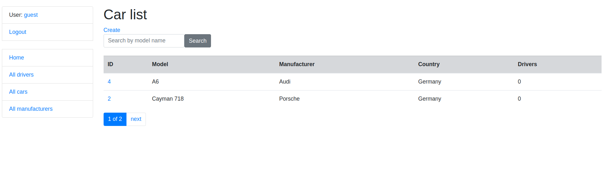

## Taxi-service

Is a Django-based Educational Project to manage drivers, cars and manufacturers in a taxi service with simple authentication.

## Check it out!

[Taxi project deployed to Heroku](https://py-taxi-service.herokuapp.com/)

## Installation

Python3 must be already installed

```shell
git clone https://github.com/nikon4uk/py-taxi-service.git
python3 -m venv venv
source venv/bin/activate
pip install -r requirements.txt
python manage.py runserver # starts Django Server
```

## Features

* Authentication functionality for Driver/User
* Managing cars drivers add manufacturers directly from website
* Powerful admin panel for advanced managing


## Demo
Home page

Car list page


## Access
Demo full accesses for guests: 
* Username - guest
* Password - easypassword
